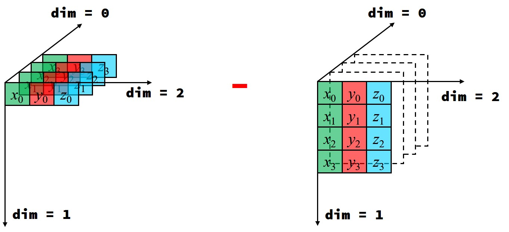
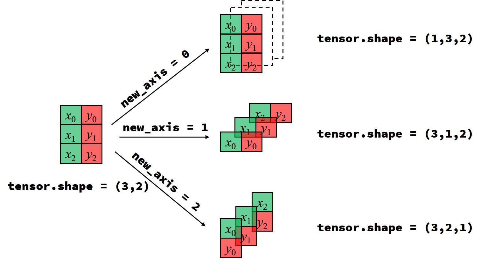

# K近邻聚类  
k-nearest neighbors, sort distances $s_{i,j}=(x_i-x_j)^2+(y_i-y_j)^2$ to find the possible clusters   
&emsp;&emsp;距离矩阵是一个三角矩阵  

$$\begin{bmatrix}
s_{0,0} & s_{0,1} & s_{0,2} & s_{0,3} \\
        & s_{1,1} & s_{1,2} & s_{1,3} \\
        &         & s_{2,2} & s_{2,3} \\
        &         &         & s_{3,3}
\end{bmatrix} \tag{1}$$  

## 广播的遍历性   
&emsp;&emsp;充分利用张量数据结构的广播特性，可高效替代循环遍历。已知4个点的坐标张量 $coords=\begin{bmatrix} \vec{r_0} & \vec{r_1} & \vec{r_2} & \vec{r_3} \end{bmatrix}^T$ ，各点与整体的差的广播结果为：

$$\begin{aligned}
\vec{r_0}-
\begin{bmatrix} 
\vec{r_0} & \vec{r_1} & \vec{r_2} & \vec{r_3}  
\end{bmatrix}=
\begin{bmatrix} 
\vec{d_{00}} & \vec{d_{01}} & \vec{d_{02}} & \vec{d_{03}}
\end{bmatrix} 
\\
\vec{r_1}-
\begin{bmatrix} 
\vec{r_0} & \vec{r_1} & \vec{r_2} & \vec{r_3}  
\end{bmatrix}=
\begin{bmatrix} 
\vec{d_{10}} & \vec{d_{11}} & \vec{d_{12}} & \vec{d_{13}}
\end{bmatrix}
\\
\vec{r_2}-
\begin{bmatrix} 
\vec{r_0} & \vec{r_1} & \vec{r_2} & \vec{r_3}  
\end{bmatrix}=
\begin{bmatrix} 
\vec{d_{20}} & \vec{d_{21}} & \vec{d_{22}} & \vec{d_{23}}
\end{bmatrix}
\\
\vec{r_3}-
\begin{bmatrix} 
\vec{r_0} & \vec{r_1} & \vec{r_2} & \vec{r_3}  
\end{bmatrix}=
\begin{bmatrix} 
\vec{d_{30}} & \vec{d_{31}} & \vec{d_{32}} & \vec{d_{33}}
\end{bmatrix}
\end{aligned}$$  


容易看出： 

$$
\begin{bmatrix} 
\vec{r_0} \\ 
\vec{r_1} \\ 
\vec{r_2} \\ 
\vec{r_3}  
\end{bmatrix}-
\begin{bmatrix} 
\vec{r_0} & \vec{r_1} & \vec{r_2} & \vec{r_3}  
\end{bmatrix}=
\begin{bmatrix} 
\vec{d_{00}} & \vec{d_{01}} & \vec{d_{02}} & \vec{d_{03}}\\
\vec{d_{10}} & \vec{d_{11}} & \vec{d_{12}} & \vec{d_{13}}\\
\vec{d_{20}} & \vec{d_{21}} & \vec{d_{22}} & \vec{d_{23}}\\
\vec{d_{30}} & \vec{d_{31}} & \vec{d_{32}} & \vec{d_{33}}
\end{bmatrix}
$$
 
&emsp;&emsp;下面按张量数据结构```torch.tensor```来推导：  

1. 距离矩阵是差值张量缩并而来  

$$
S=dX^2+dY^2 \iff \mathbb{R}^{4 \times 4}=\mathbb{R}^{4 \times 4}+\mathbb{R}^{4 \times 4} \iff \mathbb{R}^{4 \times 4} \leftarrow \mathbb{R}^{4 \times 4 \times 2}
$$  

2. 差值张量是由坐标张量广播而来  

$$
D=P-Q \iff \mathbb{R}^{4 \times 4 \times 2}=\mathbb{R}^{4 \times 1 \times 2}-\mathbb{R}^{1 \times 4 \times 2}
$$   

  

3. 坐标张量是坐标矩阵扩维而来  

$$
P \leftarrow R \iff \mathbb{R}^{4 \times 1 \times 2} \leftarrow \mathbb{R}^{4 \times 2} \\
Q \leftarrow R \iff \mathbb{R}^{1 \times 4 \times 2} \leftarrow \mathbb{R}^{4 \times 2} 
$$   


